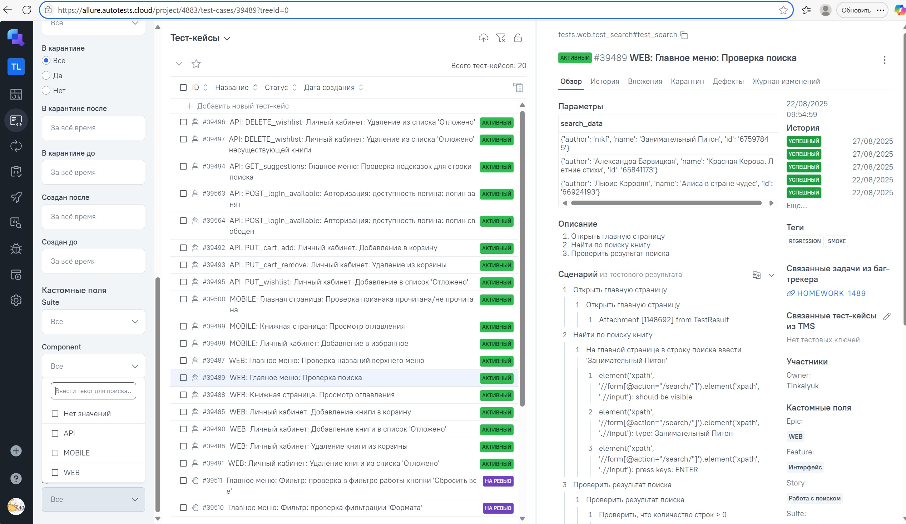
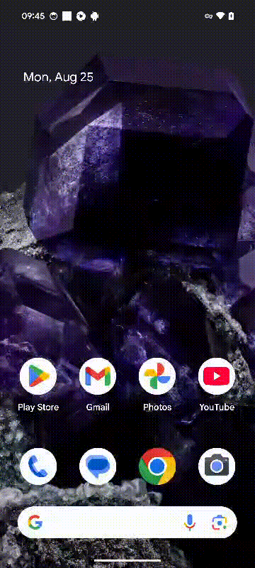

# litres_project

## Дипломный проект

Реализован во время обучения в Школе инженеров по автоматизации тестирования <a target="_blank" href="https://qa.guru">
qa.guru</a>

### Используемые технологии

    <code></code>
    <code></code>
    <code></code>
    <code></code>
    <code></code>
    <code></code>
    <code></code>
    <code></code>
    <code></code>
    <code></code>
    <code></code>
    <code></code>
    <code></code>
    <code></code>
    <code></code>

<!-- Тест кейсы -->
WEB:

* ✅ WEB: Главное меню: Проверка названий верхнего меню
* ✅ WEB: Главное меню: Проверка поиска
* ✅ WEB: Книжная страница: Просмотр оглавления
* ✅ WEB: Личный кабинет: Добавление книги в список 'Отложено'
* ✅ WEB: Личный кабинет: Удаление книги из списка 'Отложено'
* ✅ WEB: Личный кабинет: Добавление книги в корзину
* ✅ WEB: Личный кабинет: Удаление книги из корзины

API:

* ✅ API: GET_suggestions: Главное меню: Проверка подсказок для строки поиска
* ✅ API: PUT_wishlist: Личный кабинет: Добавление в список 'Отложено'
* ✅ API: DELETE_wishlist: Личный кабинет: Удаление из списка 'Отложено'
* ✅ API: DELETE_wishlist: Личный кабинет: Удаление из списка 'Отложено' несуществующей книги
* ✅ API: PUT_cart_add: Личный кабинет: Добавление в корзину
* ✅ API: PUT_cart_remove: Личный кабинет: Удаление из корзины
* ✅ API: POST_login_available: Авторизация: доступность логина: логин свободен
* ✅ API: POST_login_available: Авторизация: доступность логина: логин занят

Mobile:

* ✅ MOBILE: Личный кабинет: Добавление в избранное
* ✅ MOBILE: Главная страница: Проверка добавления/снятия признака 'Прочитана'
* ✅ MOBILE: Книжная страница: Просмотр оглавления

<!-- Jenkins -->

###  Запуск проекта в Jenkins
### [Задача в jenkins для WEB тестов](https://jenkins.autotests.cloud/job/guru20_homework22_web/)
Для запуска можно менять параметры:

### [Задача в jenkins для API тестов](https://jenkins.autotests.cloud/job/guru20_homework22_api/)
### [Задача в jenkins для Mobile тестов](https://jenkins.autotests.cloud/job/guru20_homework22_mob/)

<!-- Allure report -->

###  Allure report
WEB:

API:

Mobile:

<!-- Allure TestOps -->

###  Интеграция с Allure TestOps
##### В Allure TestOps загружены тест-кейсы из Jenkins, а также добавлены ручные тесты

<!-- Jira -->

###  Интеграция с Jira

<!-- Telegram -->

###  Оповещения в Telegram

##### После выполнения тестов, в Telegram bot приходит сообщение с графиком и информацией о тестовом прогоне.

## Видео запуска тестов
### </a> Видео запуска WEB-теста в Selenoid

### </a> Видео запуска MOBILE-теста в Browserstack

