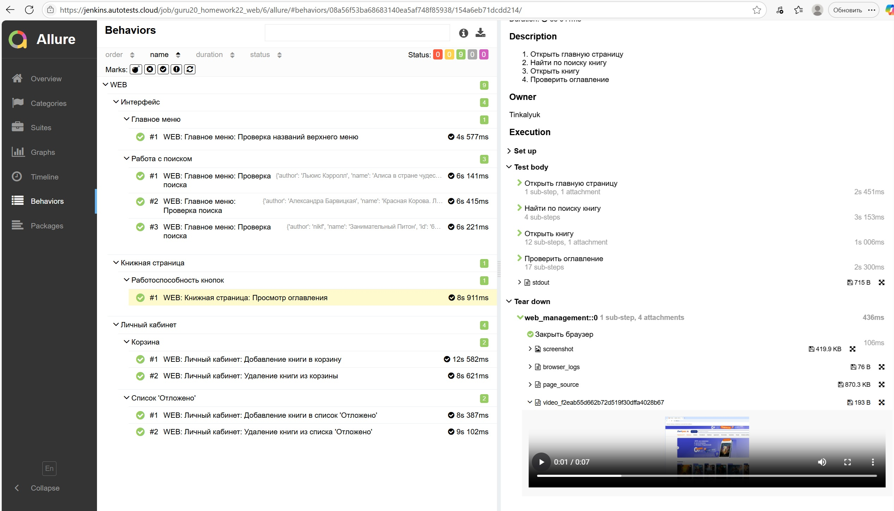
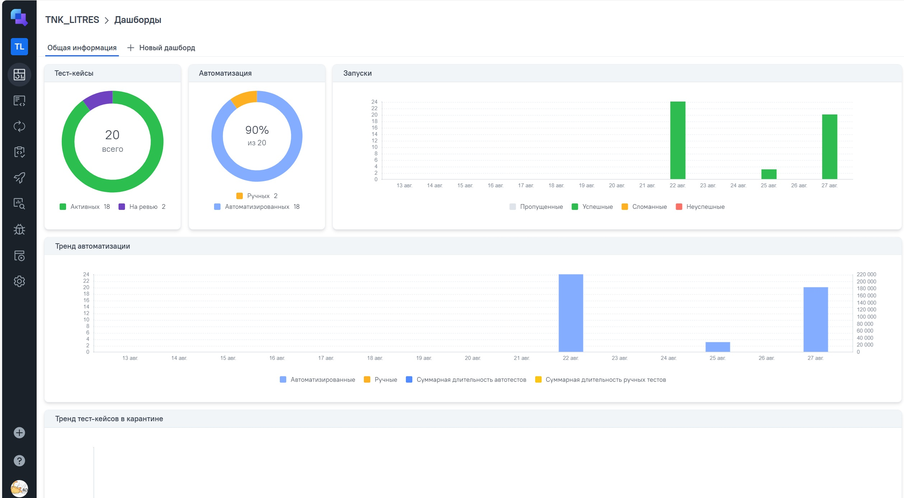
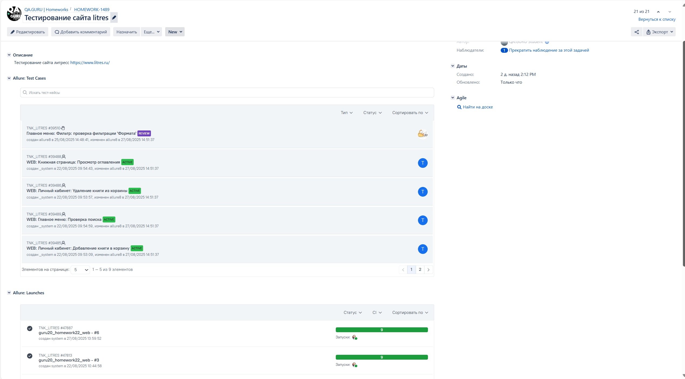
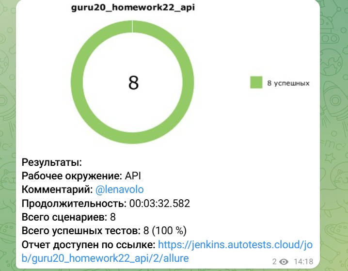
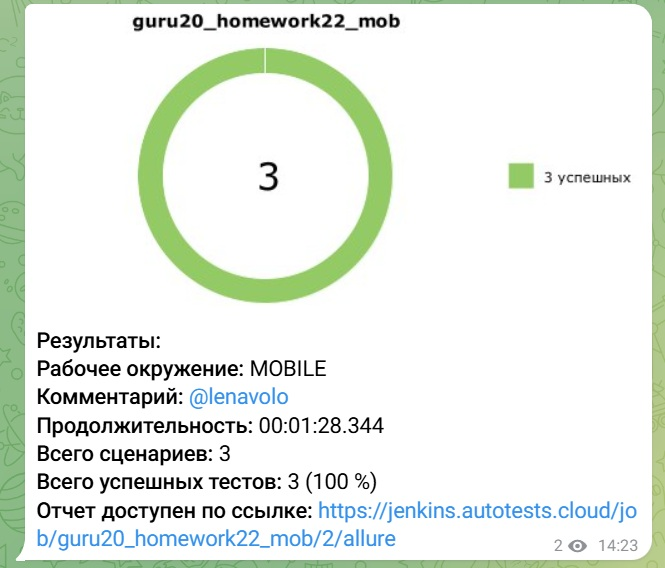

# litres_project

litres_project

## Дипломный проект

Реализован во время обучения в Школе инженеров по автоматизации тестирования <a target="_blank" href="https://qa.guru">
qa.guru</a>

### Используемые технологии

    <code></code>
    <code></code>
    <code></code>
    <code></code>
    <code></code>
    <code></code>
    <code></code>
    <code></code>
    <code></code>
    <code></code>
    <code></code>
    <code></code>
    <code></code>
    <code></code>
    <code></code>

<!-- Тест кейсы -->
UI:

* ✅ Главное меню: Проверка названий верхнего меню
* ✅ Главное меню: Проверка поиска
* ✅ Книжная страница: Просмотр оглавления
* ✅ Личный кабинет: Добавление книги в список 'Отложено'
* ✅ Личный кабинет: Удаление книги из списка 'Отложено'
* ✅ Личный кабинет: Добавление книги в корзину
* ✅ Личный кабинет: Удаление книги из корзины

API:

* ✅ Главное меню: Проверка подсказок для строки поиска
* ✅ Личный кабинет: Добавление в список 'Отложено'
* ✅ Личный кабинет: Удаление из списка 'Отложено'
* ✅ Личный кабинет: Удаление из списка 'Отложено' несуществующей книги
* ✅ Личный кабинет: Добавление в корзину
* ✅ Личный кабинет: Удаление из корзины

Mobile:

* ✅ Личный кабинет: Добавление в избранное
* ✅ Главная страница: Проверка добавления/снятия признака 'Прочитана'
* ✅ Книжная страница: Просмотр оглавления

<!-- Jenkins -->

###  Запуск проекта в Jenkins
### [Задача в jenkins для UI тестов](https://jenkins.autotests.cloud/job/guru20_homework22_web/)
### [Задача в jenkins для API тестов](https://jenkins.autotests.cloud/job/guru20_homework22_api/)
### [Задача в jenkins для Mobile тестов](https://jenkins.autotests.cloud/job/guru20_homework22_mob/)

<!-- Allure report -->

###  Allure report
UI:

API:

Mobile:

<!-- Allure TestOps -->

###  Интеграция с Allure TestOps
##### В Allure TestOps загружены тест-кейсы из Jenkins, а также добавлены ручные тесты

<!-- Jira -->

###  Интеграция с Jira

<!-- Telegram -->

###  Оповещения в Telegram

##### После выполнения тестов, в Telegram bot приходит сообщение с графиком и информацией о тестовом прогоне.

## Видео запуска тестов
### </a> Видео запуска UI-тестов в Selenoid

### </a> Видео запуска MOBILE-тестов в Browserstack

